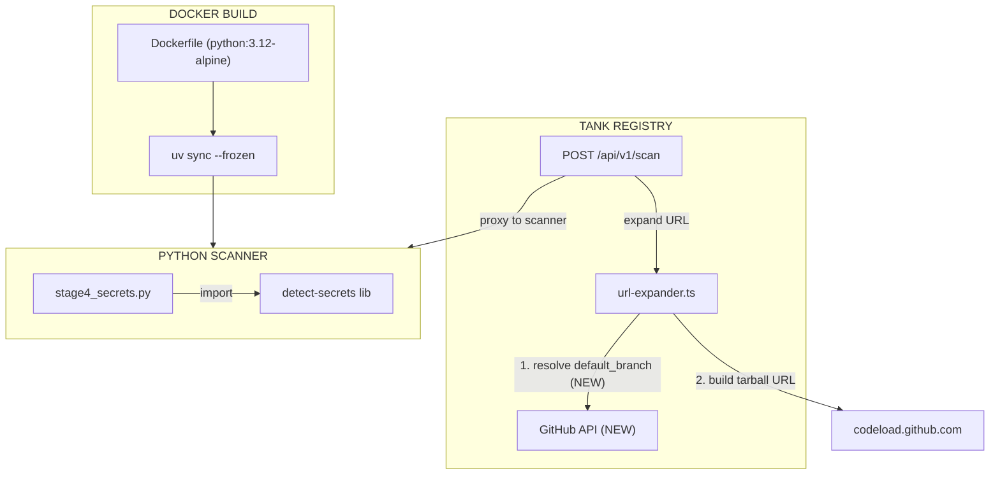

# Plan: Scan Bugfixes Trio

## Architecture



## ASCII Diagram

```
+------------------------------------------------------+
|                    USER BROWSER                       |
|                                                      |
|  /scan page                                          |
|    | url input                                       |
|    +-----> POST /api/v1/scan                         |
|    | <----- scan result                              |
|    v                                                 |
|  Scan Results                                        |
|    | Findings Table                                  |
|    |   +-- CWE links --> cwe.mitre.org               |
|    | Security Overview                               |
|                                                      |
+------------------------------------------------------+

+------------------------------------------------------+
|              TANK REGISTRY (Hono)                     |
|                                                      |
|  POST /api/v1/scan                                   |
|    |                                                 |
|    +-- expandScanUrl()  <--- FIX TARGET (Bug 2)      |
|    |     |                                           |
|    |     +-- detectURLType()                         |
|    |     +-- expandGitHubFolder()                    |
|    |     |     +-- NEW: resolveDefaultBranch()       |
|    |     |           |                               |
|    |     |           +-- GET api.github.com/repos/   |
|    |     |           |     -> default_branch         |
|    |     |           +-- fallback: main -> master    |
|    |     |                                           |
|    |     +-- expandSkillsShUrl()  (uses resolver)    |
|    |     +-- fetchSkillFileFromGitHub()  (uses it)   |
|    |     +-- scrapeAgentskillsGithub()  (uses it)    |
|    |                                                 |
|    +-- Proxy to Python scanner                       |
|                                                      |
+------------------------------------------------------+

+------------------------------------------------------+
|              PYTHON SCANNER (Docker)                  |
|                                                      |
|  Dockerfile:                                         |
|    FROM python:3.12-alpine  <--- FIX (Bug 1)        |
|    RUN uv sync --frozen                              |
|    RUN python -c "import detect_secrets"  (verify)   |
|                                                      |
|  stage4_secrets.py:                                  |
|    run_detect_secrets()                              |
|    | try:                                            |
|    +-> import detect_secrets  (NOW WORKS)            |
|    | except ImportError:                             |
|    +-> LOG + sys.version + sys.platform              |
|        severity="medium" (was "low")                 |
|                                                      |
+------------------------------------------------------+
```

## Blast Radius

| Area           | Impact                | Risk                      |
| -------------- | --------------------- | ------------------------- |
| URL expansion  | All GitHub scan paths | High -- every GitHub scan |
| Docker build   | Scanner container     | Medium -- build-only      |
| Python scanner | Error handling        | Low -- logging only       |
| Scan page      | Downstream of Bug 2   | None -- no changes needed |

## Risk: Medium

- Bug 2 fix adds network call to critical scan path -- mitigated by 10-min cache
- Bug 1 fix changes Docker base image -- mitigated by using stable 3.12
