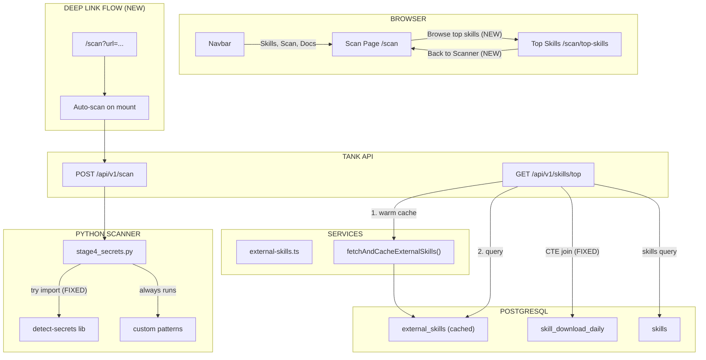

# Plan: Fix Scan & Navigation Bugs

## Architecture Diagram



## ASCII Diagram

```
+-----------------------------+     +------------------------------------+
|        BROWSER              |     |        DEEP LINK FLOW (NEW)        |
|                             |     |                                    |
| Navbar                      |     | /scan?url=agentskills.co.il/...    |
|  | Skills, Scan, Docs       |     |   |                               |
|  v                          |     |   v                               |
| Scan Page  /scan            |     | Auto-scan on mount                |
|   | "Browse top skills" NEW |     |   |                               |
|   +-------------------------+---> |   v                               |
|   |                         |     | POST /api/v1/scan                 |
|   |<---- "Back to Scanner"  |     +------------------------------------+
|   v                         |
| Top Skills  /scan/top-skills|
+-----------------------------+

+-----------------------------+     +------------------------------------+
|     TANK API                |     |     SERVICES                       |
|                             |     |                                    |
| GET /api/v1/skills/top      |     | external-skills.ts                 |
|   |                         |     |   fetchAndCacheExternalSkills()    |
|   | 1. Warm cache (NEW)     |---> |   |  mutex guard (NEW)             |
|   |                         |     |   v                                |
|   | 2. Query external       |---> | skills.sh API --> fallback seeds   |
|   | 3. Query internal (FIX) |---> +------------------------------------+
|   |                         |
+-----------------------------+

                         +------------------------------------+
                         |     POSTGRESQL                      |
                         |                                    |
                         | external_skills (cached, warmed)   |
                         | skill_download_daily               |
                         |   CTE pre-aggregate (FIX)           |
                         |   composite index (VERIFY)          |
                         | skills + scan_results               |
                         +------------------------------------+

+--------------------------------------------+
|     PYTHON SCANNER - Stage 4 (FIX)         |
|                                            |
| run_detect_secrets()                       |
|   | try:                                  |
|   +-> from detect_secrets.core.scan        |
|       import get_files_to_scan, scan_file  |
|       (ADD: version log, better fallback)  |
|   | except ImportError:                    |
|   +-> LOG WARNING (not silent)             |
|       return low-severity finding          |
|                                            |
| run_custom_patterns()                      |
|   -> always runs (unchanged)              |
|                                            |
| check_env_files()                          |
|   -> always runs (unchanged)              |
+--------------------------------------------+
```

## Blast Radius

| Area                    | Files                                        | Impact                                        |
| ----------------------- | -------------------------------------------- | --------------------------------------------- |
| Top-skills API          | `api/routes/v1/top-skills.ts`                | Add cache warm call, optimize query           |
| External skills service | `services/external-skills.ts`                | Add mutex guard                               |
| Scan route              | `routes/scan/index.tsx`                      | Add `validateSearch` for URL param            |
| Scan screen             | `screens/scan-screen.tsx`                    | Add `initialUrl` prop, auto-scan, nav link    |
| Top-skills screen       | `screens/top-skills-screen.tsx`              | Add back-link to scan                         |
| DB schema               | `lib/db/schema.ts`                           | Verify/verify index on `skill_download_daily` |
| Python stage4           | `apps/python-api/lib/scan/stage4_secrets.py` | Better error handling + logging               |
| Docker build            | `apps/python-api/requirements.txt`           | Verify detect-secrets installs                |

## Risk Assessment

| Fix                    | Risk                                | Mitigation                         |
| ---------------------- | ----------------------------------- | ---------------------------------- |
| Cache warm on API call | Low — falls back to seed data       | Mutex prevents thundering herd     |
| Query optimization     | Low — CTE is standard SQL           | Revert to subquery if regression   |
| URL param deep link    | Low — additive only                 | Graceful fallback if param missing |
| detect-secrets fix     | Low — logging only, no logic change | Custom patterns still work         |
| Navigation links       | None — pure UI additions            | N/A                                |
