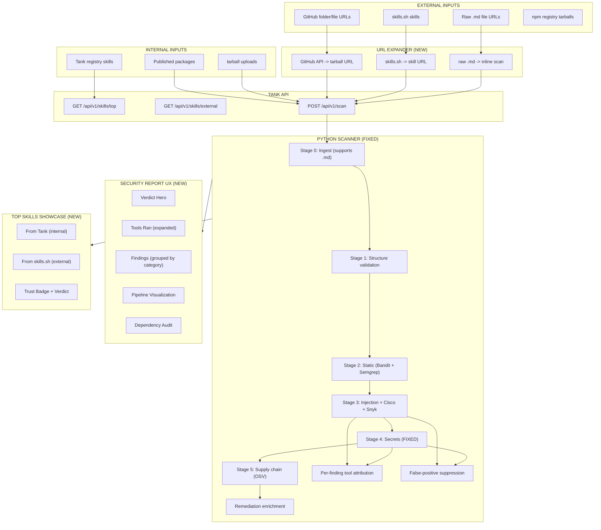

# Plan: Scanner Report Redesign

## Architecture Diagram



## ASCII Diagram

```
+-----------------------------+     +-----------------------------+
|     EXTERNAL INPUTS         |     |     INTERNAL INPUTS         |
|                             |     |                             |
| - GitHub folder/file URLs   |     | - Tank registry skills      |
| - skills.sh skills          |     | - Published packages        |
| - Raw .md file URLs         |     | - tarball uploads           |
| - npm registry tarballs     |     |                             |
+-------------+---------------+     +-------------+---------------+
              |                                   |
              v                                   v
+-------------+---------------+   +---------------+---------------+
|    URL EXPANDER (NEW)       |   |       TANK API               |
|                             |   |                               |
| - GitHub API -> tarball URL |   | GET /api/v1/skills/top        |
| - skills.sh -> skill URL    |   | GET /api/v1/skills/external   |
| - raw .md -> inline scan    |   | POST /api/v1/scan (expanded)  |
+-------------+---------------+   +---------------+---------------+
              |                                   |
              +------------------+----------------+
                                 |
                                 v
              +------------------+----------------+
              |     PYTHON SCANNER (FIXED)        |
              |                                   |
              | Stage 0: Ingest (supports .md)    |
              | Stage 1: Structure validation     |
              | Stage 2: Static (Bandit + Semgrep)|
              | Stage 3: Injection + Cisco + Snyk |
              | Stage 4: Secrets (FIXED)          |
              |   - detect-secrets WORKING        |
              |   - Custom patterns (fewer FPs)   |
              |   - Tool attribution per finding  |
              | Stage 5: Supply chain (OSV)       |
              |                                   |
              | NEW: Remediation enrichment       |
              | NEW: Per-finding tool attribution  |
              | NEW: False-positive suppression   |
              +------------------+----------------+
                                 |
                                 v
              +------------------+----------------+
              |     SECURITY REPORT UX (NEW)       |
              |                                    |
              | +--------------------------------+ |
              | | VERDICT HERO                   | |
              | | "VERIFIED" / "CONCERNS" / etc  | |
              | | Human-readable 1-line summary   | |
              | +--------------------------------+ |
              | | TOOLS RAN (expanded)            | |
              | | Cisco | Snyk | detect-secrets  | |
              | | Bandit | Semgrep | OSV | LLM   | |
              | | Each shows: ran/failed/findings | |
              | +--------------------------------+ |
              | | FINDINGS (grouped by category)  | |
              | | - Per-finding: what + why + fix | |
              | | - Remediation guidance           | |
              | | - CWE links                      | |
              | | - Confidence indicator            | |
              | +--------------------------------+ |
              | | PIPELINE VIS (kept)             | |
              | | DEP AUDIT (kept)                | |
              | +--------------------------------+ |
              +------------------------------------+

              +------------------------------------+
              |     TOP SKILLS SHOWCASE (NEW)       |
              |                                    |
              | +----------+ +-------------------+ |
              | | FROM TANK | | FROM SKILLS.SH    | |
              | | (internal)| | (external)        | |
              | +----------+ +-------------------+ |
              | | Ranked by downloads + score     | |
              | | Each skill card shows:           | |
              | |  - Trust badge                   | |
              | |  - Quick scan verdict             | |
              | |  - "Why safe" / "Why unsafe"     | |
              | |  - Click -> full security report  | |
              +------------------------------------+
```

## Blast Radius

| Area | Files | Impact |
|------|-------|--------|
| Python scanner | `stage4_secrets.py`, `models.py`, `verdict.py`, `dedup.py`, `remediation.py`, `stage3_injection.py` | Fix detect-secrets, reduce FPs, enrich findings |
| Scan API | `api/routes/v1/scan.ts`, `lib/scan/url-validator.ts` | Expand accepted URLs, new input types |
| URL expander (NEW) | `lib/scan/url-expander.ts` | GitHub/skills.sh URL normalization |
| Skill detail screen | `skill-detail-screen.tsx`, `skill-detail-helpers.tsx` | Wire remediation to UI |
| Security components | `security-overview.tsx`, `findings-table.tsx`, `scanning-tools-strip.tsx`, `scan-pipeline.tsx` | UX redesign |
| Scan screen | `scan-screen.tsx` | Accept folders, .md files, expanded results |
| Top skills (NEW) | `screens/top-skills-screen.tsx`, `api/routes/v1/top-skills.ts` | New page + API |
| DB schema | `lib/db/schema.ts` | External skill cache table |
| Data types | `lib/skills/data.ts` | `ScanFinding` adds `remediation`, `cwe_id` display |
