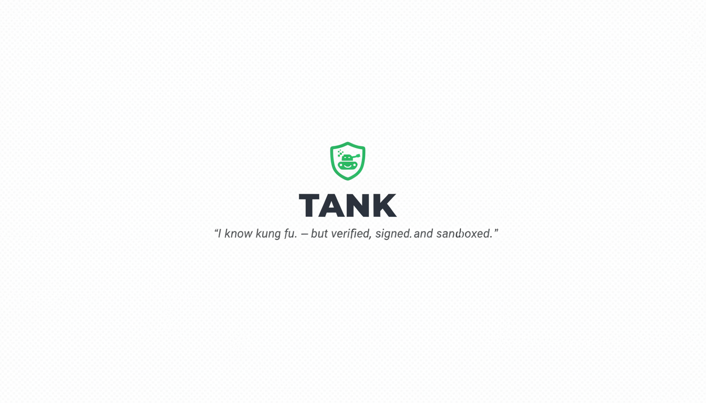

<p align="center">
  
</p>

<p align="center">
  
</p>

<h1 align="center">Tank</h1>

<p align="center">
  Security-first package manager for AI agent skills.
  <br />
  <em>"I know Kung Fu." — but verified, signed, and sandboxed.</em>
</p>

<p align="center">
  <a href="https://github.com/tankpkg/tank/blob/main/LICENSE"></a>
  <a href="https://github.com/tankpkg/tank"></a>
</p>

---

## The Problem

AI coding agents (Claude Code, Codex, Cursor) can be extended with **skills** — reusable packages that teach agents how to perform tasks. The ecosystem is growing fast: 110,000+ installs in 4 days on one registry alone.

But today's skill registries have **no versioning, no lockfiles, no permissions, no code signing, and no audit trail**. In February 2026, the ClawHavoc incident revealed that 341 malicious skills (12% of a major marketplace) were distributing credential-stealing malware.

Agent skills are more dangerous than npm packages because they execute with the **agent's full authority** — reading files, making API calls, running shell commands. The attack surface is fundamentally larger.

## What Tank Does

Tank is the **npm for agent skills**, with security built into the foundation:

| Feature | npm (2012) | Current Registries | Tank |
|---------|-----------|-------------------|------|
| Versioning | Social contract | Git tags / none | **Enforced semver** |
| Lockfile | `package-lock.json` | None | **`skills.lock`** |
| Permissions | None | None | **Declared + enforced at runtime** |
| Code signing | npm provenance (2023) | None | **Mandatory from day one** |
| Static analysis | None built-in | Basic / none | **Agent-specific rules** |
| Audit score | `npm audit` (deps only) | None | **Transparent 0-10 score** |
| Sandbox | None | None | **WASM / container isolation** |

## Quick Look

```bash
# Install a skill with full integrity verification
tank install @vercel/next-skill

# See exactly what permissions your agent has
tank permissions

# Audit everything — signatures, vulnerabilities, permission escalations
tank audit

# Publish with mandatory signing and static analysis
tank publish
```

**`skills.json`** — declare what your agent is allowed to do:

```json
{
  "skills": {
    "@vercel/next-skill": "^2.1.0",
    "@community/seo-audit": "3.0.0"
  },
  "permissions": {
    "network": { "outbound": ["*.anthropic.com"] },
    "filesystem": { "read": ["./src/**"], "write": ["./output/**"] },
    "subprocess": false
  }
}
```

If any skill exceeds the permission budget, installation fails. This single feature would have prevented ClawHavoc.

## Project Status

> **Tank is in early development.** We're building in the open from day one.

See the [Roadmap](docs/roadmap.md) for what we're building and when.

## Documentation

| Document | Description |
|----------|-------------|
| [Product Brief](docs/product-brief.md) | Full vision, features, and technical direction |
| [Roadmap](docs/roadmap.md) | Phased timeline with milestones |
| [Architecture](docs/architecture.md) | Technical design and decisions |
| [Contributing](CONTRIBUTING.md) | How to get involved |

## Why "Tank"?

In The Matrix, **Tank is the operator** — the person who loads skills into people's minds. He's the one who makes "I know Kung Fu" possible. But he doesn't just load anything blindly. He verifies, he monitors, he's the last line of defense.

That's what this project does for AI agent skills.

## Contributing

Tank is open source under the [MIT License](LICENSE). We welcome contributions of all kinds — see [CONTRIBUTING.md](CONTRIBUTING.md) to get started.

## License

[MIT](LICENSE) — do what you want, just include the license.
