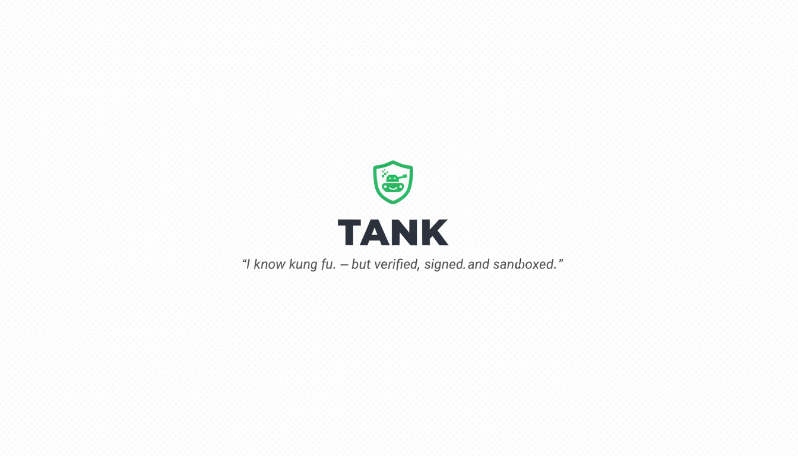
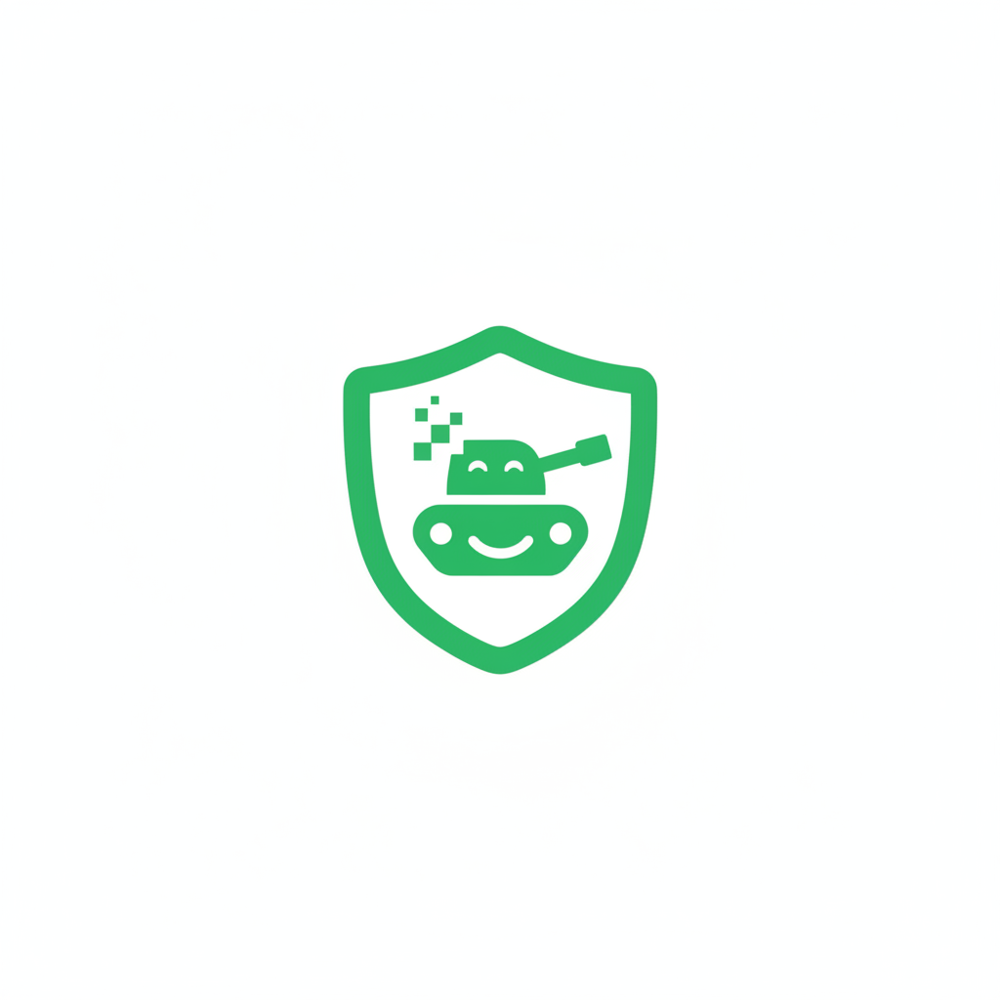

<p align="center">
  
</p>

<p align="center">
  
</p>

<h1 align="center">Tank</h1>

<p align="center">
  Security-first package manager for AI agent skills.
  <br />
  <em>"I know Kung Fu." — but verified, locked, and scanned.</em>
</p>

<p align="center">
  <a href="https://github.com/tankpkg/tank/stargazers"></a>
  <a href="https://github.com/tankpkg/tank/blob/main/LICENSE"></a>
  <a href="https://www.npmjs.com/package/@tankpkg/cli"></a>
  <a href="https://github.com/tankpkg/tank/actions"></a>
</p>

---

## The Problem

AI coding agents (Claude Code, Codex, Cursor) can be extended with **skills** — reusable packages that teach agents how to perform tasks. The ecosystem is growing fast: 110,000+ installs in 4 days on one registry alone.

But today's skill registries have **no versioning, no lockfiles, no permissions, and no security scanning**. In February 2026, the ClawHavoc incident revealed that 341 malicious skills (12% of a major marketplace) were distributing credential-stealing malware.

Agent skills are more dangerous than npm packages because they execute with the **agent's full authority** — reading files, making API calls, running shell commands. The attack surface is fundamentally larger.

## What Tank Does

Tank is the **npm for agent skills**, with security built into the foundation:

| Feature | npm (2012) | Current Registries | Tank |
|---------|-----------|-------------------|------|
| Versioning | Social contract | Git tags / none | **Semver with escalation detection** |
| Lockfile | `package-lock.json` | None | **`skills.lock` with SHA-512** |
| Permissions | None | None | **Declared + enforced at install** |
| Static analysis | None built-in | Basic / none | **6-stage security pipeline** |
| Audit score | `npm audit` (deps only) | None | **Transparent 0-10 score** |
| Code signing | npm provenance (2023) | None | Planned (Sigstore) |
| Sandbox | None | None | Planned (Phase 3) |

## Quick Look

### All CLI Commands

```bash
# Authentication
tank login                          # Authenticate via GitHub OAuth
tank whoami                         # Show current user info
tank logout                         # Clear credentials

# Project setup
tank init                           # Create skills.json interactively

# Publishing
tank publish                        # Pack and publish a skill
tank publish --dry-run              # Validate without uploading

# Installation & management
tank install @org/skill             # Install a specific skill
tank install                        # Install all from lockfile (like npm ci)
tank update @org/skill              # Update within semver range
tank update                         # Update all skills
tank remove @org/skill              # Remove a skill

# Verification & security
tank verify                         # Verify lockfile integrity
tank permissions                    # Display resolved permission summary
tank audit                          # Show security analysis results
tank audit @org/skill               # Audit a specific skill

# Discovery
tank search "query"                 # Search the registry
tank info @org/skill                # Show skill metadata
```

**`skills.json`** — declare what your agent is allowed to do:

```json
{
  "skills": {
    "@vercel/next-skill": "^2.1.0",
    "@community/seo-audit": "3.0.0"
  },
  "permissions": {
    "network": { "outbound": ["*.anthropic.com"] },
    "filesystem": { "read": ["./src/**"], "write": ["./output/**"] },
    "subprocess": false
  }
}
```

If any skill exceeds the permission budget, installation fails. This single feature would have prevented ClawHavoc.

## Development

### Prerequisites
- Node.js 24+
- pnpm 10+
- Python 3.14+ (for security analysis functions)

### Setup

```bash
git clone https://github.com/tankpkg/tank.git
cd tank
pnpm install
cp .env.example .env.local  # fill in credentials
pnpm --filter=web admin:bootstrap  # promotes FIRST_ADMIN_EMAIL to admin
```

### Commands

```bash
pnpm dev                    # Start web app in dev mode
pnpm build                  # Build all packages
pnpm test                   # Run all tests (445 TypeScript + 16 Python)
pnpm --filter=web admin:bootstrap  # Promote bootstrap admin user
pnpm test:perf              # Run performance tests (no-cache production build)
pnpm test --filter=cli      # Run CLI tests only
pnpm test --filter=web      # Run web tests only
pnpm test --filter=shared   # Run shared package tests only
```

## Project Structure

```
tank/
├── apps/
│   ├── web/          # Next.js 15 web app + API (Vercel)
│   └── cli/          # Tank CLI (TypeScript)
├── packages/
│   └── shared/       # Shared schemas, types, constants
└── docs/             # Product brief, architecture
```

## Project Status

> **Tank MVP is code-complete.** We're building in the open from day one.

## Documentation

| Document | Description |
|----------|-------------|
| [Product Brief](docs/product-brief.md) | Full vision, features, and technical direction |
| [Architecture](docs/architecture.md) | Technical design and decisions |
| [Performance Testing](docs/performance-testing.md) | Methodology and regression protocol |
| [Contributing](CONTRIBUTING.md) | How to get involved |

## Why "Tank"?


In The Matrix, **Tank is the operator** — the person who loads skills into people's minds. He's the one who makes "I know Kung Fu" possible. But he doesn't just load anything blindly. He verifies, he monitors, he's the last line of defense.

That's what this project does for AI agent skills.

## Contributing

Tank is open source under the [MIT License](LICENSE). We welcome contributions of all kinds — see [CONTRIBUTING.md](CONTRIBUTING.md) to get started.

## License

[MIT](LICENSE) — do what you want, just include the license.
