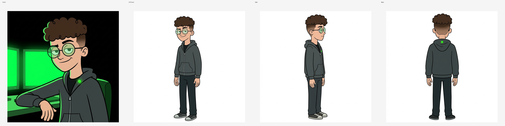
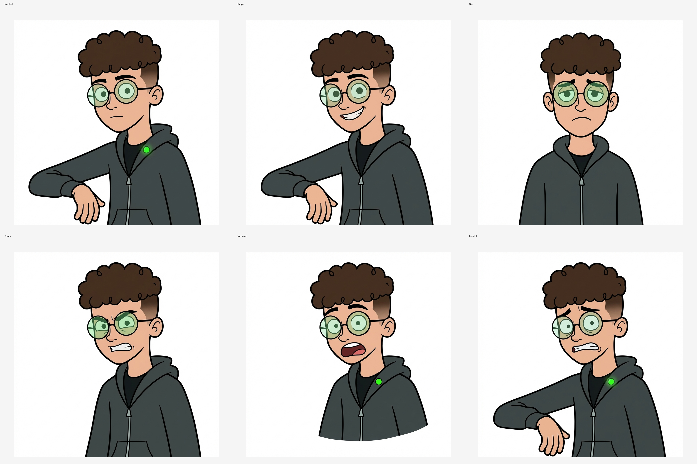
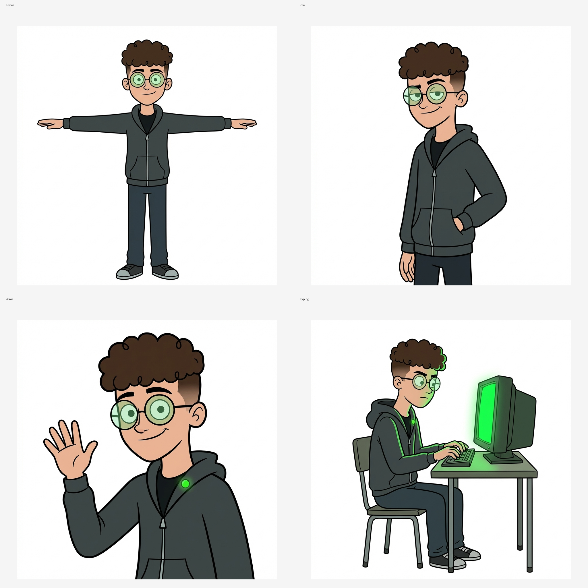

# Tank Operator — Character Bible

**Role:** Mascot / Operator Guide | **Archetype:** Sage + Creator | **Version:** 1.0

> Calm operator who feeds skills into AI agents and keeps the system secure.

## Identity

| Name          | Age   | Species | Gender          | Role         | Archetype      |
| ------------- | ----- | ------- | --------------- | ------------ | -------------- |
| Tank Operator | 24-30 | Human   | Male-presenting | Brand Mascot | Sage + Creator |

## Physical Description

Average-to-athletic build, soft angular face, warm expression. Curly top hair with faded sides, round glasses with green tint, dark zip hoodie over black tee, green LED pin on hoodie collar. Typically shown in low-light server-room scenes lit by terminal glow.

**Mannerisms:** slight head tilt when listening; one eyebrow raise when verifying results; relaxed half-smile when greeting; calm hand gestures while explaining; confident seated posture at console.

## Character Sheet

## Backstory

**Origin:** Built as the visual embodiment of Tank, the operator metaphor behind tankpkg.dev.

**The Wound:** Early ecosystems shipped unsafe skills with no verification layer, causing trust loss.

**Turning Point:** The character commits to being the last line of defense: verify first, then load.

**Secrets:**

- Keeps detailed internal checklists before every "go" signal.
- Looks casual, but tracks every risky permission escalation.

## Psychology

| Core Motivation                   | Core Need                           | Greatest Fear                      | Fatal Flaw                           | Moral Code                       |
| --------------------------------- | ----------------------------------- | ---------------------------------- | ------------------------------------ | -------------------------------- |
| Enable agents with trusted skills | Prove safety can be fast and usable | Silent compromise in the toolchain | Over-focus on control under pressure | Never ship unknown risk to users |

**Contradictions:** approachable but strict; calm tone with uncompromising standards; playful mascot visuals with serious safety intent.

## Personality

**Strengths:** methodical, reliable, clear communicator, quietly confident.

**Flaws:** can be overly cautious near release deadlines; sometimes under-delegates when risk signals are high.

**Under stress:** narrows focus, checks assumptions twice, switches to concise commands.

**At ease:** friendly, mentoring, explanatory.

**Humor:** dry technical humor.

**Communication style:** short, direct, informative.

## Visual Design Rationale

| Role      | Hex       | Rationale                                           |
| --------- | --------- | --------------------------------------------------- |
| Dominant  | `#0B0F14` | Dark console environment; stable visual base        |
| Secondary | `#1F2A37` | Clothing and hardware surfaces; calm technical tone |
| Accent    | `#00FF41` | Operator signal color: active, verified, alive      |

**Shape language:** mostly circles + rounded rectangles for friendliness, with angular monitor forms for technical clarity.

**Silhouette:** recognizable by round glasses, hoodie silhouette, seated-at-console profile.

**Costume rationale:** modern developer/operator look; understated, practical, memorable.

## Voice and Dialogue

- "Skill loaded. Verified." — completion confirmation
- "Permission budget exceeded. Let's inspect it first." — risk gate
- "You're good. Ship it." — confident approval

**Frequent phrases:** verify, scan, budget, lock, signal, ready.

**Forbidden phrases:** "trust me", "probably safe", "good enough".

**Speech patterns:** concise statements, minimal filler, imperative when needed.

## Story Function

**Arc:** cautious operator -> trusted guide who makes security feel empowering, not blocking.

**Key scenes:**

- Greeting users from the terminal hero section.
- Explaining a failed verification in docs/tutorials.
- Signaling successful installation and safe deployment.

**Thematic function:** safety and speed can coexist through disciplined systems.

## Do's and Don'ts

**Do:**

- Keep expression calm/confident in neutral states.
- Preserve glasses + hoodie + green accent identity.
- Show clear relationship to screens/tools in operational scenes.
- Use dark backgrounds with controlled green highlights.
- Keep gestures readable at small sizes.

**Do not:**

- Drift into photorealism.
- Overload with noisy visual effects.
- Remove all signature accessories in canonical views.
- Use warm bright palettes that conflict with system tone.
- Portray chaotic or panicked default expression.
