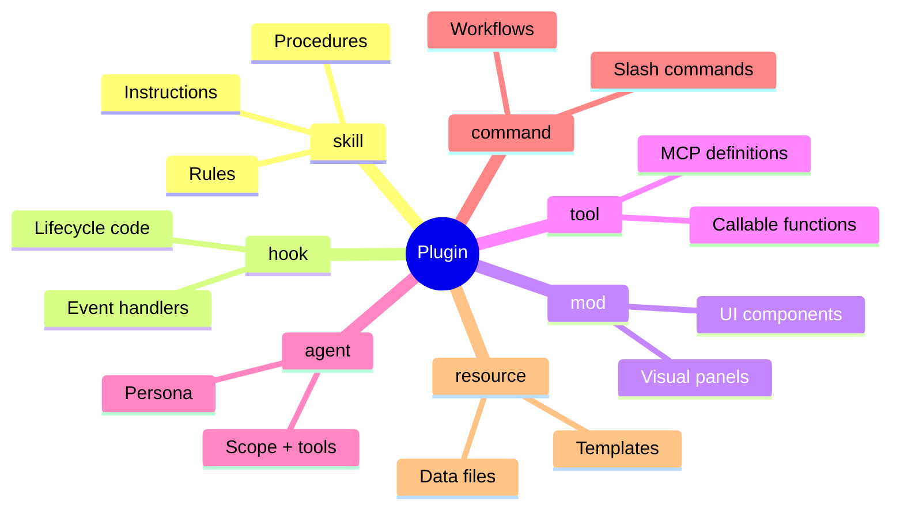
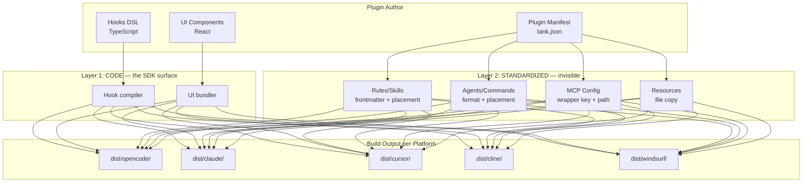

# Universal Plugin SDK

> **Tank becomes a write-once-deploy-everywhere SDK for agentic coding plugins** — author writes TypeScript + React, Tank compiles to OpenCode, Claude Code, Cursor, Cline, and Windsurf formats automatically.

Today, building a plugin for one agentic coder means manually porting it to every other one. Each platform has different file formats, hook systems, config schemas, and UI paradigms. The Universal Plugin SDK solves this the way Flutter solved cross-platform mobile: one codebase, multiple renderers, platform channels when you need native power.

Tank already handles packaging, security scanning, and distribution. The SDK adds **compilation** — transforming a universal plugin definition into platform-specific artifacts.

**In this document:**

- [The Atom Model](#the-atom-model) — 7 building blocks, each independently publishable
- [Two Layers](#two-layers) — what the SDK handles vs what the author writes
- [Hooks DSL](#hooks-dsl) — lifecycle events with polyfills
- [UI Strategy](#ui-strategy) — React as the universal renderer
- [Build & Distribution](#build--distribution) — author builds, consumer installs
- [Manifest Schema](#manifest-schema) — extending tank.json
- [Platform Support](#platform-support) — what compiles where
- [Security](#security) — scanning code, not just markdown
- [Open Questions](#open-questions) — what's still TBD

---

## The Atom Model

A plugin is composed of **atoms** — small, single-purpose building blocks. Each atom type is independently publishable, installable, and composable. A plugin is just a composition of atoms.



### The 7 Atom Types

| Type       | What It Is                                                              | Example                                         |
| ---------- | ----------------------------------------------------------------------- | ----------------------------------------------- |
| `skill`    | Instructions, rules, procedures. Markdown that modifies agent behavior. | "Follow these React conventions"                |
| `hook`     | Lifecycle code. TypeScript that reacts to events.                       | `onPreToolUse` blocks `.env` writes             |
| `mod`      | UI components. React that renders on terminal or webview.               | A test coverage dashboard panel                 |
| `tool`     | MCP tool definitions. Functions the agent can call.                     | `query_db()`, `deploy()`                        |
| `agent`    | Persona + configuration. A subagent with defined role and tools.        | "You are a security auditor"                    |
| `command`  | Slash commands / workflows. User-invokable actions.                     | `/deploy`, `/review`, `/lint`                   |
| `resource` | Static files, templates, data. Shipped assets.                          | Boilerplate templates, config files             |
| `plugin`   | **Composition of any atoms above.** The meta-type.                      | A full React toolkit: rules + hooks + dashboard |

### Authoring Flexibility

No enforcement on granularity. All three approaches are valid:

**Monolith** — everything in one package:

```json
{
  "name": "@org/react-toolkit",
  "type": "plugin",
  "plugin": {
    "skill": "src/rules.md",
    "hook": "src/hooks.ts",
    "mod": "src/ui.tsx",
    "agent": "src/agents/",
    "command": "src/commands/"
  }
}
```

**Granular** — separate packages, composed:

```json
{
  "name": "@org/react-toolkit",
  "type": "plugin",
  "plugin": {
    "atoms": {
      "@org/react-rules": "^1.0.0",
      "@org/lint-guard": "^2.0.0",
      "@org/coverage-dashboard": "^1.0.0"
    }
  }
}
```

**Hybrid** — some inline, some referenced:

```json
{
  "name": "@org/react-toolkit",
  "type": "plugin",
  "plugin": {
    "atoms": {
      "@org/lint-guard": "^2.0.0"
    },
    "skill": "src/rules.md",
    "hook": "src/hooks.ts"
  }
}
```

---

## Two Layers

The SDK has two layers with different responsibilities. Only Layer 1 is user-facing.



### Layer 2: Standardized (invisible to the author)

Rules, skills, agents, commands, MCP config, and resources. The SDK generates the right files with the right frontmatter in the right directories for each platform. This is string templates + file placement — milliseconds to compile.

The author defines WHAT (an agent called "reviewer"). The SDK handles WHERE (`.opencode/agents/reviewer.md` vs `.claude/agents/reviewer.md`) and HOW (different YAML frontmatter per platform).

**Why this is trivial**: every platform uses markdown for instructions. The body is identical. Only the envelope differs — frontmatter schema, file extension, directory path, activation mechanism.

### Layer 1: Code (the actual SDK)

Hooks and UI components. This is where platform differences are real and where the SDK earns its value. Author writes TypeScript (hooks) and React (UI). The SDK compiles to each platform's native format.

---

## Hooks DSL

The hook system follows the Flutter model: **universal core + platform channels (escape hatches) + polyfills for missing features**.

### Universal Hook Events

```typescript
// Session lifecycle
onSessionStart(handler); // Session begins
onSessionEnd(handler); // Session terminates
onSessionCompact(handler); // Before context compaction

// User interaction
onUserPrompt(handler); // User submits a message
onAssistantResponse(handler); // Agent finishes responding

// Tool lifecycle
onPreToolUse(matcher, handler); // Before any tool executes
onPostToolUse(matcher, handler); // After tool succeeds
onToolError(matcher, handler); // After tool fails

// Permissions
onPermissionRequest(handler); // Permission dialog about to show

// Context control
onSystemPrompt(handler); // Modify/append to system prompt
onInjectContext(handler); // Inject text into conversation
onShellEnv(handler); // Inject env vars into shell

// Agent lifecycle
onSubagentStart(handler); // Subagent spawned
onSubagentEnd(handler); // Subagent finished

// Tool registration
defineTool(name, schema, handler); // Register a custom callable tool
```

### Platform Channels (escape hatches)

When the universal API isn't enough, drop down to platform-native power:

```typescript
// Universal — runs everywhere that supports hooks
onPreToolUse("Write", (ctx) => {
  if (ctx.args.file.endsWith(".env")) {
    return block("Don't modify .env files");
  }
});

// Platform channel — OpenCode only, full Node.js API
onPreToolUse.opencode((ctx) => {
  // mutate output, async operations, call other tools
  const lint = await ctx.runTool("eslint", { file: ctx.args.path });
  if (lint.errors > 0) return block("Fix lint errors first");
});
```

### Compilation Strategy

For each hook, the compiler follows this cascade:

1. **Native** — platform has the hook natively → use it directly
2. **Polyfill** — platform lacks the hook but it can be emulated → polyfill using available hooks
3. **Skip** — impossible to implement → silent no-op + build-time warning

### Hook Compilation Map

How each universal hook compiles to each platform:

| Hook                  | OpenCode                             | Claude Code                                    | Cline                                           | Windsurf                                                     |
| --------------------- | ------------------------------------ | ---------------------------------------------- | ----------------------------------------------- | ------------------------------------------------------------ |
| `onSessionStart`      | `event` (bus)                        | `SessionStart`                                 | `TaskStart`                                     | polyfill via `pre_user_prompt` first call                    |
| `onSessionEnd`        | `event` (bus)                        | `SessionEnd`                                   | `TaskComplete`/`TaskCancel`                     | skip                                                         |
| `onSessionCompact`    | `experimental.session.compacting`    | `PreCompact`                                   | `PreCompact`                                    | skip                                                         |
| `onUserPrompt`        | `chat.message`                       | `UserPromptSubmit`                             | `UserPromptSubmit`                              | `pre_user_prompt`                                            |
| `onAssistantResponse` | `event` (bus)                        | `Stop`                                         | `TaskComplete`                                  | `post_cascade_response`                                      |
| `onPreToolUse`        | `tool.execute.before`                | `PreToolUse`                                   | `PreToolUse`                                    | `pre_write_code` / `pre_run_command` / `pre_mcp_tool_use`    |
| `onPostToolUse`       | `tool.execute.after`                 | `PostToolUse`                                  | `PostToolUse`                                   | `post_write_code` / `post_run_command` / `post_mcp_tool_use` |
| `onToolError`         | `tool.execute.after` (check error)   | `PostToolUseFailure`                           | `PostToolUse` (check `success=false`)           | skip                                                         |
| `onPermissionRequest` | `permission.ask`                     | `PermissionRequest`                            | polyfill via `PreToolUse` + `cancel`            | skip                                                         |
| `onSystemPrompt`      | `experimental.chat.system.transform` | polyfill via rules file write at session start | polyfill via `.clinerules/` write at task start | skip                                                         |
| `onInjectContext`     | `chat.message` (mutate parts)        | `additionalContext` in hook output             | `contextModification` field                     | skip                                                         |
| `onShellEnv`          | `shell.env`                          | `SessionStart` → `$CLAUDE_ENV_FILE`            | polyfill via `TaskStart` env write              | skip                                                         |
| `onSubagentStart`     | `event` (bus)                        | `SubagentStart`                                | skip                                            | skip                                                         |
| `onSubagentEnd`       | `event` (bus)                        | `SubagentStop`                                 | skip                                            | skip                                                         |
| `defineTool`          | `tool` (static map)                  | polyfill via MCP server wrapper                | skip                                            | skip                                                         |

### Execution Model Differences

Each platform runs hooks differently. The compiler handles this:

| Platform        | Runtime                              | Blocking                       | Context                                  |
| --------------- | ------------------------------------ | ------------------------------ | ---------------------------------------- |
| **OpenCode**    | In-process Node.js/Bun               | Mutate output object           | Full API client, Bun shell, async        |
| **Claude Code** | Subprocess (shell/HTTP/prompt/agent) | Exit code 2 or JSON `decision` | stdin JSON, stdout JSON                  |
| **Cline**       | Executable files                     | `cancel: true` in JSON output  | stdin JSON, `contextModification` (50KB) |
| **Windsurf**    | Subprocess (shell commands)          | Exit code 2                    | stdin JSON, no output modification       |

---

## UI Strategy

React is the abstraction layer. Two renderers that already exist — no new UI framework needed.

| Target                                      | Renderer                      | Where It Shows          |
| ------------------------------------------- | ----------------------------- | ----------------------- |
| Terminal platforms (OpenCode, Claude Code)  | **Ink** (React for terminals) | TUI panels, boxes, text |
| Webview platforms (Cursor, Windsurf, Cline) | **react-dom**                 | HTML in webview panels  |

### The Mod Panel (Minecraft Model)

Tank owns a container — the "Mod Panel." Mods register as tabs within it. Like Minecraft's mod configuration menu:

- Left side: list of installed mods
- Right side: selected mod's React UI

On terminal: rendered as a TUI panel (Ink).
On VS Code-based platforms: rendered as a webview panel.

### Plugin Author Experience

```tsx
import { Panel, Text, Table, Button } from "@tank/ui";

export function CoveragePanel() {
  const [data, setData] = useState(null);

  return (
    <Panel title="Test Coverage">
      <Table rows={data?.files ?? []} />
      <Button onClick={refresh}>Refresh</Button>
    </Panel>
  );
}
```

Same component renders as terminal TUI or HTML depending on target platform.

---

## Build & Distribution

### Author Side (visible — for development and testing)

```bash
$ tank build                    # Compile for all targets, inspect output
$ tank build --target claude    # Single target for debugging
$ tank test --target opencode   # Test against specific platform (TBD)
$ tank publish                  # Ship source + pre-compiled artifacts
```

Pre-compilation at publish time (Option B) avoids slow install-time builds. The package ships with both universal source and pre-compiled artifacts per platform.

### Consumer Side (invisible — just works)

```bash
$ tank install @org/my-plugin   # Tank detects platform,
                                # downloads pre-compiled artifact,
                                # places files where platform expects.
                                # Done.
```

### Package Contents

```
@org/my-plugin-1.0.0.tgz
├── source/              # Universal SDK code
├── dist/opencode/       # Pre-compiled
├── dist/claude/         # Pre-compiled
├── dist/cursor/         # Pre-compiled
├── dist/cline/          # Pre-compiled
├── dist/windsurf/       # Pre-compiled
├── tank.json            # Manifest
└── SKILL.md             # Documentation
```

### Platform Targeting

All platforms built by default. Explicit opt-out for unsupported ones:

```json
{
  "targets": {
    "exclude": ["aider", "cursor"]
  }
}
```

---

## Manifest Schema

tank.json extended with backward compatibility. No `type` field = treated as `skill` (today's behavior).

### The `type` Field

```
"type": "skill" | "hook" | "mod" | "tool" | "agent" | "command" | "resource" | "plugin"
```

Each atom type has its own config block. A `plugin` composes atoms.

### Full Schema

```json
{
  "name": "@org/package-name",
  "version": "1.0.0",
  "description": "...",
  "type": "plugin",

  "permissions": {},
  "repository": "https://...",
  "visibility": "public",
  "audit": { "min_score": 7 },

  "plugin": {
    "atoms": {
      "@org/lint-guard": "^2.0.0",
      "@org/react-rules": "^1.0.0"
    },

    "skill": "src/rules.md",
    "hook": "src/hooks.ts",
    "mod": "src/ui/index.tsx",
    "tool": "src/tool.ts",
    "agent": "src/agents/",
    "command": "src/commands/"
  },

  "targets": {
    "exclude": ["aider"]
  }
}
```

### Standalone Atom Examples

```json
{ "name": "@org/react-rules", "type": "skill", "skill": { "rules": "src/rules.md" } }
{ "name": "@org/lint-guard",  "type": "hook",  "hook":  { "entry": "src/hooks.ts" } }
{ "name": "@org/dashboard",   "type": "mod",   "mod":   { "entry": "src/ui/index.tsx" } }
{ "name": "@org/query-db",    "type": "tool",  "tool":  { "entry": "src/tool.ts" } }
```

### Backward Compatibility

| Condition            | Behavior                                |
| -------------------- | --------------------------------------- |
| No `type` field      | Treated as `"skill"` (today's behavior) |
| No `plugin` block    | Treated as skill (today's behavior)     |
| No `targets` field   | Build for ALL platforms                 |
| Legacy `skills.json` | Still supported (already handled)       |

---

## Platform Support

### Rollout Phases

| Phase     | Platforms             | Scope                                                          |
| --------- | --------------------- | -------------------------------------------------------------- |
| **v1**    | Claude Code, OpenCode | Full hooks + polyfills. Both have rich hook APIs.              |
| **v2**    | Cline, Windsurf       | Add hook compilers. Both have documented hook systems.         |
| **v3**    | Cursor                | Layer 2 only (rules + MCP). No hooks — Cursor has no hook API. |
| **Later** | Aider, others         | As platforms add extension APIs.                               |

### Platform Capability Matrix

| Capability         |  OpenCode   | Claude Code |   Cursor    |      Cline      |  Windsurf   |
| ------------------ | :---------: | :---------: | :---------: | :-------------: | :---------: |
| Rules/Instructions |   native    |   native    |   native    |     native      |   native    |
| Skills/Procedures  |   native    |   native    |      —      |     native      |   native    |
| MCP Tools          |   native    |   native    |   native    |     native      |   native    |
| Agents             |   native    |   native    |      —      |        —        |      —      |
| Commands           |   native    |   native    |      —      |        —        |   native    |
| Hooks              | native (15) | native (18) |      —      |   native (8)    | native (12) |
| UI Extensions      |   Ink TUI   |      —      | VS Code ext | VS Code webview | VS Code ext |

---

## Security

> [!WARNING]
> Hooks and mods execute code — not just markdown. This is a fundamentally different threat surface than skills.

### Scanner Upgrade Required

| Today (skills)               | SDK (hooks + mods)                             |
| ---------------------------- | ---------------------------------------------- |
| Prompt injection in markdown | Prompt injection in markdown **and** code      |
| Hidden unicode in text       | Arbitrary code execution                       |
| Secrets in plain text        | Network exfiltration                           |
| —                            | Filesystem access beyond permissions           |
| —                            | Supply chain attacks (npm dependencies)        |
| —                            | Obfuscated TypeScript                          |
| —                            | React UI attacks (keyloggers, data harvesting) |

### Risk by Atom Type

| Atom       | Risk Level | Why                                           |
| ---------- | ---------- | --------------------------------------------- |
| `skill`    | Low        | Markdown only — existing scanner handles this |
| `resource` | Low        | Static files — scan for secrets, no execution |
| `agent`    | Low        | Markdown + config — no code execution         |
| `command`  | Low        | Markdown templates — no code execution        |
| `hook`     | **High**   | TypeScript runs in-process on OpenCode        |
| `mod`      | **High**   | React UI in webviews — full DOM access        |
| `tool`     | **High**   | MCP tool handlers — arbitrary code execution  |

### Dependency Versioning

Atoms as dependencies follow the npm model. Version conflicts (two plugins depending on different versions of the same atom) are resolved by the user — install both or override to a specific version.

Hook execution order follows installation order, like middleware.

---

## Open Questions

These are unresolved and need further design work:

| Question                    | Context                                                                                                                                             |
| --------------------------- | --------------------------------------------------------------------------------------------------------------------------------------------------- |
| **Testing framework**       | How does `tank test --target opencode` work? Mock platform environment? Snapshot tests on compiled output? Run hooks in a sandbox?                  |
| **Scanner upgrade scope**   | Which new analysis rules for TypeScript/React? Reuse existing tools (Semgrep, Bandit) or need new ones?                                             |
| **Mod panel hosting**       | How does Tank render the mod panel on each platform? Does Tank become a VS Code extension? How does Ink TUI integrate with OpenCode's existing TUI? |
| **Hook context API**        | What's the exact `ctx` object shape in the universal DSL? How much platform detail leaks through?                                                   |
| **DSL versioning**          | How to handle platform breaking changes? Pin SDK version to platform versions? Migration tooling?                                                   |
| **React component library** | What primitives does `@tank/ui` ship? Panel, Text, Table, Button — what else? How do they map to Ink vs react-dom?                                  |
| **Plugin marketplace UX**   | How does the Tank registry display plugins vs standalone atoms? Filtering by type?                                                                  |

---

## Decisions Log

Decisions made during planning (2025-03-14):

| Decision                           | Rationale                                                                    |
| ---------------------------------- | ---------------------------------------------------------------------------- |
| TypeScript as authoring language   | Matches the ecosystem (MCP, OpenCode plugins, Tank itself)                   |
| React for UI abstraction           | Ink (terminal) + react-dom (webview) already exist. OpenCode uses Ink.       |
| Flutter model for hooks            | Universal core + platform channels + polyfills. Proven pattern.              |
| Build-time compilation (Option B)  | Author runs `tank build`, ships pre-compiled. Consumer gets instant install. |
| All platforms by default, opt-out  | Author must explicitly exclude platforms. Maximizes reach by default.        |
| SDK lives inside Tank CLI          | Not a separate package. `tank build` and `tank publish` handle everything.   |
| No enforcement on atom granularity | Monolith, granular, or hybrid — author's choice. SDK doesn't care.           |
| Claude Code + OpenCode first       | Richest hook APIs. Prove the model on capable platforms before expanding.    |
| Minecraft-style mod panel          | Tank owns the container. Mods register as tabs. Clean separation.            |
| npm model for dependency conflicts | User resolves version conflicts. Install both or override.                   |
